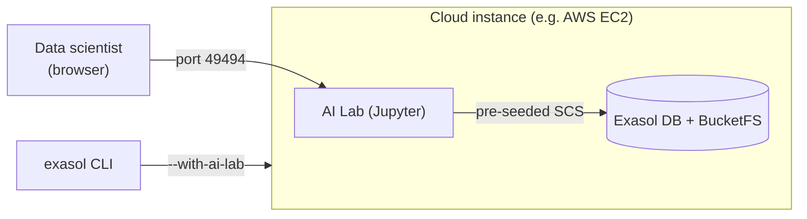

# AI Lab

The [Exasol AI Lab](https://github.com/exasol/ai-lab) is a ready-to-use JupyterLab environment for data science and AI work against your database. Exasol Personal can install and pre-wire it automatically on the same infrastructure as your database — **one flag, zero manual configuration**.

Currently, AI Lab is available on **cloud deployments only** — it is not offered for local deployments because the UDFs and BucketFS it relies on are not available locally.

## Install

Install AI Lab together with the database by adding `--with-ai-lab`:

```bash
exasol install aws --with-ai-lab
```

When enabled, the launcher:

- runs the `exasol/ai-lab` container (via rootless Podman) on the database host,
- pre-configures its connection to the Exasol database and BucketFS, so notebooks work with **no manual configuration**,
- exposes the AI Lab port (default `49494`, configurable with `--ai-lab-port`) over **HTTPS** through the deployment's firewall, restricted by `--allowed-cidr` and protected by a generated Jupyter password.

## Reaching it

After installation, `exasol info` prints the AI Lab URL (`https://…`). The Jupyter password and the config-store master password are stored in `secrets.json` in the deployment directory (the same place as the database credentials) — they are not printed to the terminal.

Jupyter is served over HTTPS using the deployment's self-signed certificate — the same certificate the Admin UI uses. Your browser will warn about the certificate on first connection; accept the warning and continue.

## Architecture



The AI Lab container runs **as a sidecar next to the Exasol database on the same instance**, under rootless Podman. At install time the launcher:

- opens a dedicated security-group ingress rule for the AI Lab port, and
- injects the database and BucketFS credentials into the container's **Secure Configuration Storage (SCS)** — so every notebook can connect to the database and BucketFS immediately, over `host.containers.internal`, without any additional setup.

## Security

Jupyter is served over HTTPS, so the login password and session are encrypted in transit. The Jupyter and config-store passwords are generated per deployment and stored only in `secrets.json`.

Still restrict `--allowed-cidr` to a trusted range (or reach the AI Lab through an SSH tunnel) rather than leaving it open. Two reasons beyond the login itself:

- The notebook is pre-wired to the database with the `sys` credentials, so notebook access is effectively database access.
- To let notebooks build Script Language Containers, the host's container engine socket is mounted into the AI Lab container (the upstream-documented mechanism). That means code running in a notebook can drive the host's rootless Podman — so treat notebook access as equivalent to access to the host's unprivileged `ubuntu` user, and protect it accordingly.
