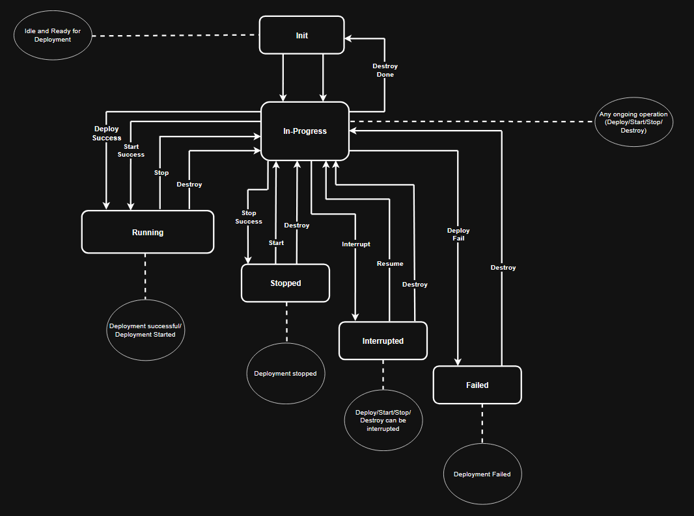

# Deployment state & locking

Exasol deployments have a lifecycle that begins with `init` (or `install`), continues with `deploy`, and ends with `destroy`.

The launcher keeps this lifecycle consistent across command invocations using two files in the deployment directory:

- A **persistent state file** (`.exasolLauncherState.json`) that records the deployment's current workflow state and additional launcher metadata.
- A **temporary lock file** (`.exasolLock.json`) that prevents concurrent, conflicting operations.

Deployment compatibility also relies on a stable, plain-text deployment-version marker file (`.exasolLauncher.version`).

This document is an architecture guide for developers. It describes what is stored in these files, the invariants they must uphold, and the intended usage patterns.

## Persistent state: `.exasolLauncherState.json`

The persistent state file is the source of truth for the deployment's lifecycle.

It has two responsibilities:

- **Workflow coordination:** record the current workflow state so commands can enforce a consistent lifecycle across process invocations.
- **Launcher metadata:** persist additional launcher-level information that must survive restarts (for example, version-check bookkeeping and deployment compatibility metadata).

The version-checking feature stores its bookkeeping in this file; for details, see `doc/version_checking.md`.

The deployment compatibility mechanism reads the deployment version from the marker file (`.exasolLauncher.version`); for details, see [Deployment directory compatibility](deployment_compatibility.md).

### Key invariants

These are the invariants the code must preserve (independent of implementation details):

- The file must remain readable/writable by the launcher throughout the workflow.
- The workflow state is a **single, unambiguous value** at any point in time.
- Commands must treat the persistent state as the contract for what operations are safe/allowed next.
- The deployment version (used for compatibility checks) is written when the deployment directory is created and remains immutable for the lifetime of the deployment directory.
- The deployment-version marker is a long-term contract: its presence, identity, and location must remain stable over time so that future launchers can always perform compatibility checks before doing any work.
- Developers should avoid editing this file by hand; it is meant to be machine-managed.

## Workflow states (intended meaning)

The workflow states are the contract between commands (and across process restarts). They are also what `status` reports.

- `initialized`
    - The deployment directory is ready for `deploy`.
    - Written at the end of `init`, and after a successful `destroy`.

- `operationInProgress` (records which operation is in progress: `deploy`, `start`, `stop`, `destroy`)
    - Set at the start of long-running operations.
    - Helps `status` explain what is happening and helps the launcher distinguish “retry the same operation” from “conflicting operation”.

- `interrupted` (records which operation was interrupted and why)
    - Set when a command is interrupted (for example via Ctrl-C).
    - Used to decide what a user is allowed to retry.

- `deploymentFailed` (records a deploy failure)
    - Set when `deploy` fails in a non-interrupt way.
    - This state exists to prevent the launcher from silently continuing as if the deployment were healthy.

- `running`
    - Written after a successful `deploy` or `start`.

- `stopped`
    - Written after a successful `stop`.

## How commands should use state + lock together

Commands that mutate a deployment directory should follow a consistent, conservative pattern:

1. **Acquire the deployment lock** before making any changes.
    - This prevents concurrent launcher processes from modifying the same deployment directory at the same time.

2. **Read the persistent state** and **validate** that the requested operation is permitted.
    - The validation rules are the guard rails for safety and idempotency.

3. **Set `operationInProgress`** before starting any external/long-running work.
    - This makes the operation visible to `status` and to any later retry/recovery logic.

4. **Handle interrupts deliberately**.
    - If a command is interrupted, it should set `interrupted` with enough information to guide a safe retry.
    - When the operation succeeds, ensure any interrupt handling can no longer overwrite the final state.

5. **Commit a terminal state** on success.
    - `deploy`/`start` should end in `running`.
    - `stop` should end in `stopped`.
    - `destroy` should end in `initialized` so `deploy` can be run again.

6. **Commit a failure state** on failure (when appropriate).
    - `deploymentFailed` exists to make non-retryable `deploy` failures explicit.

Some operations that only read state (for example, `status`) generally do not need to take the lock.
Operations that update the persistent state (including version-check bookkeeping) should use the lock to avoid races with lifecycle commands.

## Temporary lock: `.exasolLock.json`

The lock file is created at the start of deployment-directory-dependent operations and removed when the operation finishes.

- If the lock already exists, the launcher must fail fast (the deployment directory is assumed to be in use).
- Lock acquisition/release should be robust against interrupts so that locks are not leaked.

### Forceful unlocking (`exasol unlock`)

The `unlock` command deletes the lock file.

This is a recovery tool for cases where a previous launcher process crashed and did not clean up.
It does **not** repair the workflow state and it cannot guarantee that the deployment directory is consistent.

As a rule: do not `unlock` unless you are certain no other launcher instance is running for that deployment directory.

## Workflow diagram

The diagram below shows the conceptual state machine.

