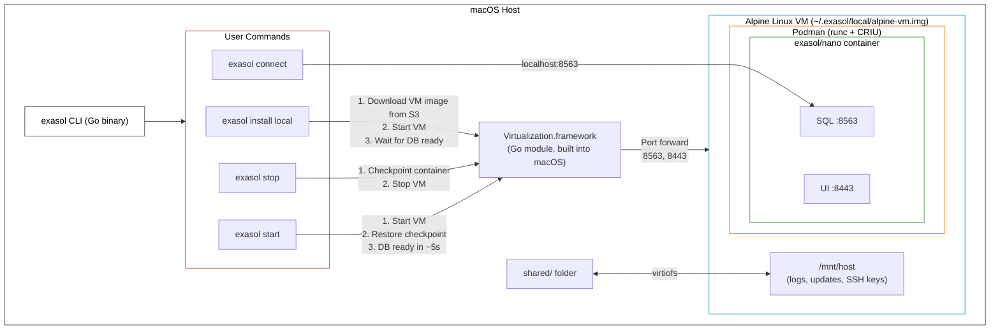

# Production Architecture (macOS)



# Basic Requirements

We require a minimal linux virtual machine to distribute Exasol Nano. The vm must work on apple silicon using `vfkit`.

The container image type must be `.img`. We cannot use the smaller `.qcow2` disk image format because the macos virtualization tool `vfkit` does not support it. For sharing directories with the host, we must use `virtiofs` for the same reason.

## Possible Windows requirements

Running a VM on windows will always require admin rights. The VM can be run on Hyper-V without additional dependencies.

Hyper-V requires the disk image is converted to VHDX.

On windows we do not have access to virtiofs, instead we can mount a VHDX file as an dynamically expanding disk.
This slightly complicates adding new ssh keys, as the disk will need to be mounted to the host to access its content.

# Usage

1. `task install-deps` installs QEMU and any other dependencies that are required for building this disk image.

2. `task build` does several tasks. Once these tasks are complete, you can use `task start-vm`.
    - Downloads the base disk image
    - Extends its size, to make room for new packages
    - Configures it with cloud-init
    - Reduces its size, leaving an empty 100mb of space for logs

3. `task start-vm` starts the (pre-initialized) vm in the background. You can then use `task connect` to ssh into it and `task startup-benchmark` to 

4. `task stop-vm` stops the vm.

5. `task package` compresses the `disk.img` file

While a vm is running, you can use:

1. `task connect` to ssh into it

2. `task test` to run:
    - Test that new authorized ssh keys can be added via the shared folder
    - Test that a podman container be started and can write to the shared folder

## Minimizing the container

shrinks the root disk image by mounting it to the host

# VM Configuration

BuildVM uses two configuration files for different purposes:

## init-vm-config.json (Build-Time Configuration)

Used only during `task init-vm` to configure VM resources for the build process:

```json
{
  "cpus": 2,
  "memoryMB": 2048,
  "description": "VM build-time configuration (init-vm only). For runtime config, see vm-config.json."
}
```

You can customize CPU and memory for faster or slower builds. This configuration is NOT included in packaged VMs.

## vm-config.json (Runtime Configuration)

Used by `task start-vm` and included in packaged VMs. Configures runtime resources and port forwarding:

```json
{
  "cpus": 2,
  "memoryMB": 2048,
  "description": "VM runtime configuration. Containers will automatically inherit these resources.",
  "ports": [
    {"protocol": "tcp", "host": 8080, "vm": 8080}
  ]
}
```

**Configuration fields:**
- `cpus`: Number of CPUs allocated to the VM
- `memoryMB`: Memory in MB allocated to the VM
- `ports`: (Optional) Array of port forwarding rules
  - `protocol`: "tcp" or "udp"
  - `host`: Port on host machine
  - `vm`: Port inside VM (where container listens)

**Port forwarding examples:**

Passthrough (same port on host and VM):
```json
"ports": [
  {"protocol": "tcp", "host": 8080, "vm": 8080}
]
```

Port remapping (different ports):
```json
"ports": [
  {"protocol": "tcp", "host": 9000, "vm": 8080},
  {"protocol": "tcp", "host": 9001, "vm": 3000}
]
```

Multiple ports:
```json
"ports": [
  {"protocol": "tcp", "host": 8080, "vm": 8080},
  {"protocol": "tcp", "host": 9000, "vm": 3000},
  {"protocol": "udp", "host": 5353, "vm": 5353}
]
```

**Empty ports array**: Explicitly disables container port forwarding (SSH on port 2222 only).

**Platform-specific behavior:**
- **QEMU (Linux dev)**: Automatic port forwarding via `-netdev user,hostfwd=...`
  - Access: `http://localhost:8080` (uses host port, first number in config)
- **vfkit (macOS)**: Automatic port forwarding via `--device virtio-net,nat,guestPort=X,hostPort=Y`
  - Access: `http://localhost:8080` (uses host port, first number in config)
- **Hyper-V (Windows)**: No automatic port forwarding
  - Access: `http://<vm-ip>:8080` (uses VM port, second number in config)
  - **Important**: The host port (first number) is ignored for direct IP access
  - VM IP is written to `vm-ip.txt` in the same directory as the data disk
  - Example: `{"protocol": "tcp", "host": 9000, "vm": 8080}` → connect to `http://<vm-ip>:8080` (not port 9000)
  - Optional: Configure NetNat for localhost access (see startup script output)

# Shared directory

Containers receive a 

## Adding new authorized keys

**Security Model**: Only SSH keys present in the `shared/authorized_keys` file will have access to the VM. All other keys are removed on startup.

When you run `task start-vm`, the VM's SSH key (`vm-key.pub`) is automatically copied to `shared/authorized_keys`. This key is used by `task connect` to access the VM.

When you run `task stop-vm`, the key is automatically removed from the shared folder.

## Podman containers

The vm is configured to run one podman container. To install a container, move it to the shared directory and register it in the `container-manifest.json` file.

Use `task prepare-container` to copy your container and manifest to the shared folder. The included test container (`test-podman-container/`) and `test-container` task are **placeholders for demonstration purposes** - replace them with your actual container.

```json
{
  "containerFile": "test-server-container.tar.gz",
  "ports": [8080],
  "args": ["-dir", "/data", "-port", "8080"],
  "mounts": [
    {
      "hostPath": "./container-data",
      "containerPath": "/data"
    }
  ]
}
```

**Manifest fields:**
- `containerFile`: Path to the container tarball (relative to shared folder)
- `ports`: Array of port numbers the container exposes (e.g., `[8080]` for single port, `[8080, 3000]` for multiple)
  - These ports must be configured in vm-config.json for host forwarding
- `args`: Command-line arguments passed to the container
- `mounts`: (Optional) Array of volume mounts
  - `hostPath`: Path on host, relative to shared folder (e.g., `./container-data` → `/mnt/host/container-data`)
  - `containerPath`: Path inside container (e.g., `/data`)
  - Paths containing `..` are rejected for security
  - If no mounts specified, container runs without volume mounts

**Multiple mounts example:**
```json
{
  "containerFile": "app.tar.gz",
  "ports": [3000, 8080],
  "args": ["--config", "/etc/app/config.yaml"],
  "mounts": [
    {
      "hostPath": "./app-data",
      "containerPath": "/data"
    },
    {
      "hostPath": "./app-config",
      "containerPath": "/etc/app"
    },
    {
      "hostPath": "./app-logs",
      "containerPath": "/var/log/app"
    }
  ]
}
```

### Container Loading Behavior

Containers are loaded:
1. **During VM build** (init-vm) - If a container is present in the shared folder during build, it's loaded into the VM image
2. **On each startup** - The VM checks the shared folder for new/updated containers

This allows the VM to:
- Work with containers even when the shared folder is empty (uses the container loaded during build)
- Automatically update to new containers when placed in the shared folder

**Container Loading Scenarios:**

| Situation | Manifest Source | Action |
|-----------|----------------|--------|
| **First boot after init-vm** | Shared folder | Load container, store manifest to `/var/lib/` |
| **Subsequent restart, shared folder available** | Shared folder | Check checksum, reload only if changed |
| **Restart, shared folder empty/deleted** | Stored (`/var/lib/container-manifest.json`) | Start existing container (no reload) |
| **Container tarball updated** | Shared folder | Detect via checksum, reload container |
| **No manifest anywhere** | None | Try starting any existing container |

The manifest is stored at `/var/lib/container-manifest.json` after the first successful container load. This enables containers to restart even when the shared folder is unavailable, which is critical for:
- Hyper-V scenarios without a data disk attached
- Testing VM portability without build artifacts present
- Production deployments where the VM is fully self-contained

### Port Validation

**Important**: Before running `task init-vm`, all container ports must be configured in vm-config.json.

The build process validates that every port listed in the container manifest's `ports` array is exposed in vm-config.json. If validation fails, you'll see an error like:

```
Error: Container ports not exposed in vm-config.json

Container manifest specifies ports: 8080 3000
vm-config.json exposes ports: 8080

Missing ports in vm-config.json: 3000
```

**To fix**: Update vm-config.json to include all container ports:

```json
{
  "cpus": 2,
  "memoryMB": 2048,
  "ports": [
    {"protocol": "tcp", "host": 8080, "vm": 8080},
    {"protocol": "tcp", "host": 3000, "vm": 3000}
  ]
}
```

This ensures containers can be accessed from the host on the expected ports after the VM is built.

### Container Data Tolerance

**Important**: Containers must be designed to tolerate missing or empty mount points.

If your container defines volume mounts in the manifest, mounted directories may:
- Be missing if the shared folder is unavailable (e.g., Hyper-V without data disk attached)
- Be empty if the user clears the shared folder

Containers should:
- Check for mount availability and handle gracefully if missing
- Recreate default data/configuration files if mounted directories are empty
- Continue operating with reduced functionality if persistent storage is unavailable

The container loading script automatically creates host mount directories before starting the container, but the underlying shared folder (`/mnt/host`) may not always be available.

# Debugging

## VM debugging

While `task init-vm` is running, the logs of the vm are written to `vm-init.log`

While `task start-vm` is running, the logs of the vm are written to `vm.log`

## Podman container debugging

Container loading logs are written to `shared/logs/` for debugging:

```bash
# For the logs of the container loading startup proceedure, see
less shared/logs/container-load-*.log

# For the stdout logs of the container itself, see
less shared/logs/container-runtime-*.log
```